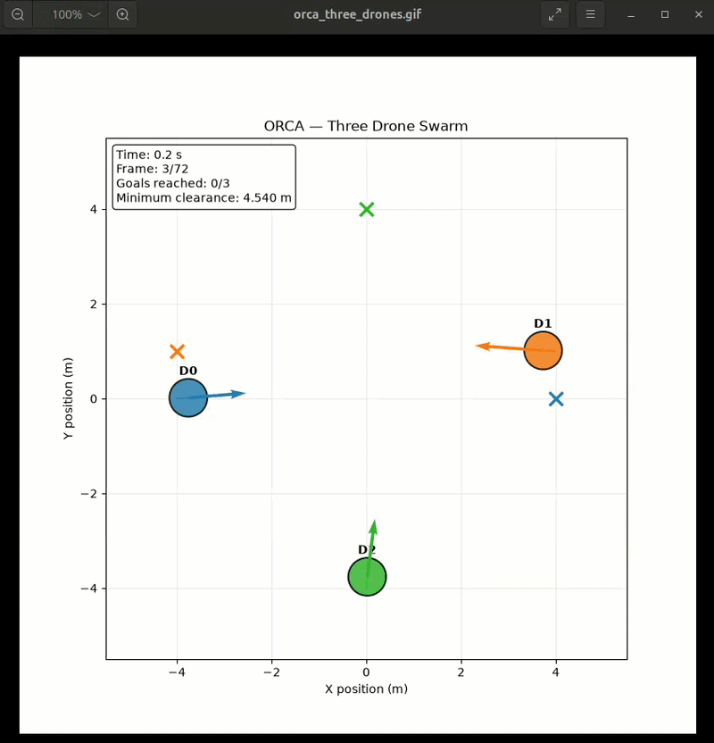

# 🚁 ORCA-Based Multi-Drone Collision Avoidance

A three-drone simulation implementing **ORCA (Optimal Reciprocal Collision Avoidance)** for decentralized collision avoidance and autonomous navigation.

## 📌 Overview

ORCA is a velocity-based collision-avoidance algorithm designed for multi-agent systems.

In this project, three autonomous drones navigate toward their respective targets while continuously adjusting their velocities to avoid collisions with other drones.

```text
             Target 1
                ★
               ↗
          D1  ↗

             D2
              ↘
               ↘
                D3 ─────► ★
                         Target 3
```

Each drone independently calculates a collision-free velocity based on the predicted motion of neighboring drones.



## 🎯 Objectives

* Simulate a three-drone swarm.
* Implement decentralized collision avoidance.
* Navigate drones toward target positions.
* Maintain safe inter-drone separation.
* Minimize unnecessary changes in velocity.
* Study the behavior of ORCA in multi-UAV environments.

## 🧠 How ORCA Works

For every drone:

1. Detect nearby drones.
2. Predict possible future collisions.
3. Construct velocity constraints.
4. Determine the set of safe velocities.
5. Select a velocity close to the preferred target velocity.
6. Move the drone using the selected velocity.

```text
Preferred Velocity
        │
        ▼
 ┌───────────────┐
 │ ORCA Constraint│
 │   Generation   │
 └───────┬───────┘
         │
         ▼
 Collision-Free
    Velocity
         │
         ▼
      Drone
     Movement
```

## ⚙️ Important Parameters

| Parameter         | Description                                |
| ----------------- | ------------------------------------------ |
| `dt`              | Simulation time step                       |
| `neighbor_radius` | Distance for detecting other drones        |
| `time_horizon`    | Future collision prediction interval       |
| `robot_radius`    | Effective drone radius                     |
| `max_speed`       | Maximum drone velocity                     |
| `goal_threshold`  | Distance considered as reaching the target |

## 🛸 Simulation

The simulation contains:

* 3 drones
* Individual target positions
* Collision detection
* Velocity updates
* ORCA constraints
* Trajectory visualization
* Minimum inter-drone clearance

## ▶️ Run

```bash
python orca_three_drones.py
```

## 📊 Evaluation

The implementation can be evaluated using:

* Collision count
* Minimum clearance
* Path length
* Time to target
* Final goal error
* Computational time

## 🔬 Future Improvements

* Dynamic obstacles
* Formation control
* More complex environments
* Hybrid ORCA + APF
* ROS 2 integration
* PX4/Gazebo integration
* Real UAV testing

## 📚 Application

ORCA is particularly useful as a **local collision-avoidance layer** in a larger UAV swarm architecture.

```text
Global Planner
      ↓
Waypoint / Path Planner
      ↓
ORCA
      ↓
Collision-Free Velocity
      ↓
PX4 Flight Controller

